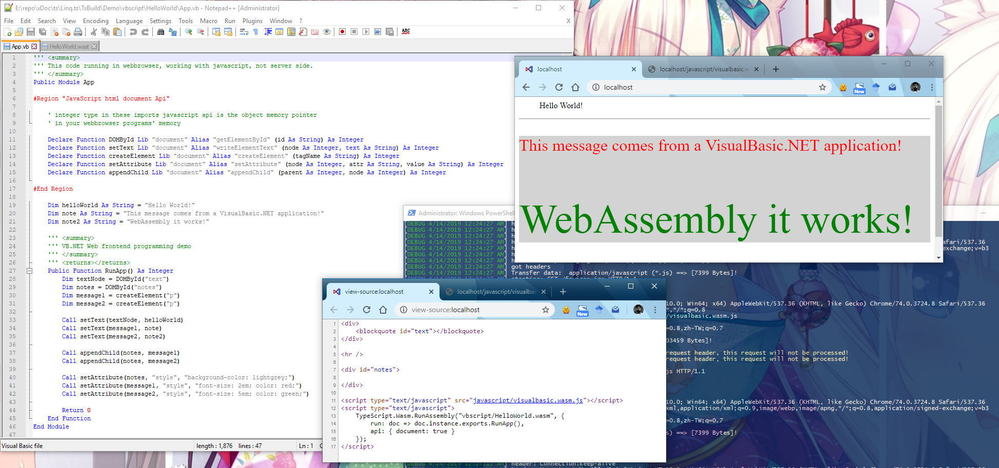

# WebAssembly for VisualBasic.NET

## FAQ

#### 1. Which platform that I can running my VisualBasic.NET application

Theoretically, you can develop your VisualBasic.NET application for Windows/Linux/Mac/IOS/Android, from PC, mobile phone, tablet and Raspberry Pi, running on every platform if the platform supports WebAssembly!

#### 2. How fast that my VisualBasic.NET can running

Theoretically, your VisualBasic.NET application is running as fast as C/C++ application, as VisualBasic.NET is generate same assembly code as C/C++ application it does.

#### 3. Can I run my VisualBasic.NET application on nodejs environment

yes! If your current nodejs environment supports WebAssembly.

#### 4. Can I publish my VisualBasic.NET application onto npm

yes! If the npm supports WebAssembly package.

#### 5. Win32/.NET Framework api supports?

no! Only supports the api that javascript expose to your VisualBasic.NET application. So .NET Framework is no longer available if you target your VisualBasic.NET application to WebAssembly platform. This is a very ``Core`` version, which means almost all of the things must create from scratch if you target your VB.NET application to WebAssembly platform.

#### 6. What can I do with WebAssembly

WebAssembly is a kind of solution for aimed at high-density computing on javascript environment, so the best choice is HTML5 Game development using VisualBasic.NET with Unity, or Edge computing for your business. And of course you can develop any application for every platform, so on.

## Using WebAssembly compiler for VB.NET

Using WebAssembly compiler for VB.NET language, follow these steps:

#### 1. Write your applications' code

Write your VisualBasic.NET application in VisualStudio, and then save it.

```vbnet
Module Demo

    Declare Function Print Lib "console" Alias "log" (text As String) As Integer

    Public Function HelloWorld() As Integer 
        Call Print("Hello World!")
        Return 0
    End Function

End Module
```

> Project only supports a single source file, a single module, ``Class/Structure/Enum/Array`` is not supports yet in current version of the VB.NET wasm compiler, but all of this VB.NET programming feature will be supportted in future works. Probably not supports generic method.

#### 2. Run wasm compiler

Current version VB.NET wasm compiler just supports compile a single source file. A VB.NET project with multiple source file will be supported in the future. For compile a VB.NET application, create a console application, and add reference to ``VisualBasic.Wasm.dll``, at last write these code for compile your VisualBasic source file:

```vbnet
Dim vb = "/path/to/app.vb"
Dim [module] = Wasm.CreateModule(vb)

' Target Assembly file (*.wasm)
[module].Compile("HelloWorld.wasm")
' Compiler debug used only (*.wast, *.dmp)
[module].ToSExpression.SaveTo("HelloWorld.wast")
[module].HexDump(True).SaveTo("HelloWorld.dmp")
```

> Compiler project source file available at: https://github.com/GCModeller-Cloud/data.ts/tree/878d93e4d011f666d0dc4dbc0062a6fd1685bc9b/TsBuild/Wasm

#### 3. Run VB.NET application from javascript environment

Add script reference to ``visualbasic.wasm.js``, and then running VB.NET application on web browser or nodejs from a javascript loader like:

```javascript
let assmUrl = "vbscript/HelloWorld.wasm";

TypeScript.Wasm.RunAssembly(assmUrl, {
    // run app from a public method which its name is
    // RunApp or something else
    run: VB => VB.instance.exports.RunApp(),
    // some build-in javascript api that expose to VB.NET application
    api: { document: true, console: true },
    // Other javascript api expose to VB.NET application, like jquery, bootstrap, etc
    imports: {}
});
```

